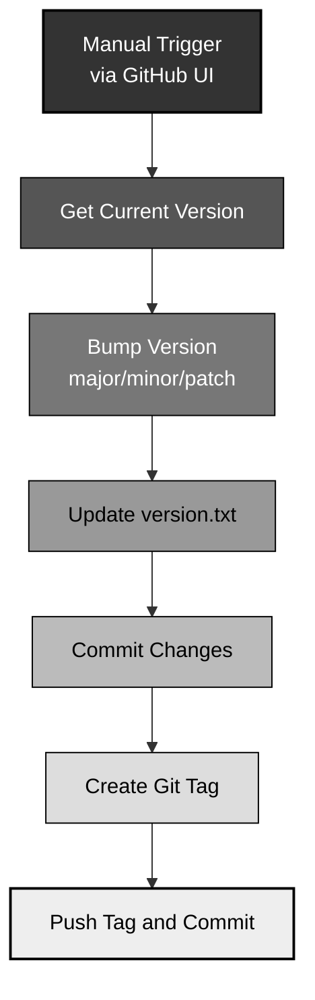

# CI/CD Workflow Documentation

This document describes the Continuous Integration and Continuous Deployment (CI/CD) workflows for the johnburbridge.com
website.

## Workflow Overview

The CI/CD pipeline consists of four main workflows:

1. **PR Workflow** - Triggered when a pull request is opened against the main branch
2. **Main Workflow** - Triggered when changes are pushed to the main branch (PR merge)
3. **Tag Workflow** - Manually triggered to create a new version tag
4. **Validation Workflow** - Triggered when changes are made to workflow files

## Pull Request and Merge Flow

```mermaid
flowchart TB
    subgraph "Feature Development"
        A[Create Feature Branch] --> B[Make Changes]
        B --> C[Create Pull Request]
    end

    subgraph "PR Workflow"
        C --> D[Run Linters]
        D --> E[Get Semantic Version]
        E --> F[Build Container]
        F --> G{Push to Registry}
        G --> H[Comment on PR with Image Info]
        H --> I[PR Review]
    end

    subgraph "Merge Process"
        I --> J[Merge PR to main]
        J --> K[Main Workflow Triggers]
    end

    subgraph "Main Workflow"
        K --> L[Get Semantic Version]
        L --> M[Extract PR Number from Commit]
        M --> N[Pull Dev Image]
        N --> O[Retag as Release Version]
        O --> P[Push Release Tags]
        P --> Q[Create GitHub Release]
    end

    %% Gray styling for all nodes
    style A fill:#555555,stroke:#000,stroke-width:1px,color:#fff
    style B fill:#666666,stroke:#000,stroke-width:1px,color:#fff
    style C fill:#777777,stroke:#000,stroke-width:1px,color:#fff
    style D fill:#888888,stroke:#000,stroke-width:1px,color:#fff
    style E fill:#999999,stroke:#000,stroke-width:1px,color:#000
    style F fill:#999999,stroke:#000,stroke-width:1px,color:#000
    style G fill:#aaaaaa,stroke:#000,stroke-width:1px,color:#000
    style H fill:#aaaaaa,stroke:#000,stroke-width:1px,color:#000
    style I fill:#bbbbbb,stroke:#000,stroke-width:1px,color:#000
    style J fill:#cccccc,stroke:#000,stroke-width:1px,color:#000
    style K fill:#cccccc,stroke:#000,stroke-width:1px,color:#000
    style L fill:#dddddd,stroke:#000,stroke-width:1px,color:#000
    style M fill:#dddddd,stroke:#000,stroke-width:1px,color:#000
    style N fill:#e0e0e0,stroke:#000,stroke-width:1px,color:#000
    style O fill:#e5e5e5,stroke:#000,stroke-width:1px,color:#000
    style P fill:#eeeeee,stroke:#000,stroke-width:1px,color:#000
    style Q fill:#f5f5f5,stroke:#000,stroke-width:2px,color:#000
```

## Version Tagging Process

The version tagging process is independent of the pull request and merge flow. It's manually triggered to create a new
semantic version.

## Detailed Process

### 1. Pull Request Process

When a new pull request is created against the main branch, the PR workflow is triggered automatically:

1. **Checkout Repository**: The workflow checks out the repository code.

2. **Setup Node.js and Install Dependencies**: Node.js is set up and dependencies are installed using `npm ci`.

3. **Lint Code**: The code is linted using the defined linters in `package.json`.

   - If linting fails, a comment is posted on the PR with the warning.
   - The workflow continues regardless of linting results (non-blocking).

4. **Generate Version Number**:

   - Retrieves the latest semantic version tag (or uses `v0.1.0` if none exists).
   - Appends `-dev.pr{PR_NUMBER}` to create a development version.
   - Example: `1.2.3-dev.pr42`

5. **Build and Push Docker Image**:

   - Logs in to the GitHub Container Registry (ghcr.io).
   - Builds a Docker image with the development version number.
   - Pushes the image with two tags:
     - `ghcr.io/johnburbridge/johnburbridge-site:{VERSION}-dev.pr{PR_NUMBER}`
     - `ghcr.io/johnburbridge/johnburbridge-site:pr-latest`
   - The version number is embedded in the image via build args.

6. **Comment on PR**:
   - Posts a comment on the PR with information about the built image.
   - Includes instructions on how to pull and run the image for testing.

### 2. Merge to Main Process

When a pull request is merged to the main branch, the main workflow is triggered:

1. **Checkout Repository**: The workflow checks out the repository code.

2. **Get Semantic Version**:

   - Retrieves the latest semantic version tag (or uses `v0.1.0` if none exists).
   - Removes the `v` prefix to get the raw version number.

3. **Extract PR Number**:

   - Extracts the PR number from the merge commit message.
   - This is used to find the development image that was built during the PR process.

4. **Pull and Retag Development Image**:

   - Pulls the development image: `{VERSION}-dev.pr{PR_NUMBER}`
   - Retags it with two new tags:
     - `ghcr.io/johnburbridge/johnburbridge-site:{VERSION}` (semantic version)
     - `ghcr.io/johnburbridge/johnburbridge-site:latest`
   - Pushes both tags to GitHub Container Registry.

5. **Create GitHub Release**:
   - Creates a new GitHub release with the tag `v{VERSION}`.
   - Automatically generates release notes based on PR/commit history.

### 3. Version Tagging Process

This workflow is manually triggered to create a new version:

1. **Input Selection**: The user selects the type of version bump (major, minor, or patch).

2. **Get Current Version**:

   - Retrieves the latest semantic version tag.
   - Parses it into major, minor, and patch components.

3. **Bump Version**:

   - Increments the appropriate component based on the selected bump type.
   - Major: Increments major, resets minor and patch to 0.
   - Minor: Increments minor, resets patch to 0.
   - Patch: Increments patch only.

4. **Update Version File**:

   - Updates `version.txt` with the new version number.
   - Commits this change to the repository.

5. **Create and Push Tag**:
   - Creates a new Git tag (`v{NEW_VERSION}`).
   - Pushes the tag and the version file commit to the repository.

## Version Format

The system follows Semantic Versioning (SemVer) conventions:

- **Release versions**: `MAJOR.MINOR.PATCH` (e.g., `1.2.3`)
- **Development versions**: `MAJOR.MINOR.PATCH-dev.pr{PR_NUMBER}` (e.g., `1.2.3-dev.pr42`)

## Image Registry

All Docker images are stored in GitHub Container Registry (ghcr.io) under: `ghcr.io/johnburbridge/johnburbridge-site`

## Important Notes

1. **PR Workflow**:

   - Creates a development version of the container.
   - This allows testing the exact image that will be deployed if merged.

2. **Main Workflow**:

   - Does not rebuild the image - it reuses the PR image to ensure exactly the same code is deployed.
   - This approach eliminates inconsistencies between what was tested and what is deployed.

3. **Version Tagging**:
   - Should be performed before starting work on features that require a version bump.
   - The workflow only updates the version tag; it does not trigger a new image build on its own.
